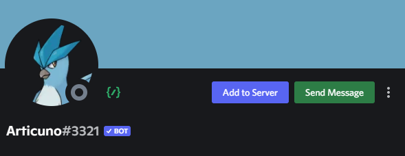

# Articuno (interactions.py)  
A small and fun Discord Bot that is written in interactions.py, using Python.

 (not available)

> This is a full rewrite from scratch, using [interactions.py](https://github.com/interactions-py/library).

# (Testing) A minimal bot
Instruction:
- Install requirements library: ``pip install -r requirements.txt``
- Put your bot's token in ``.env`` file after ``TOKEN=``.
- Run ``python main.py``

# Denying requests from particular servers
- Put the guild ID in ``./data/servers.json``.
