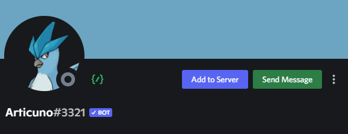

# Articuno  
A fun Discord Bot, written with interactions.py.

# What makes us different?
First and always, API wrapper library. Being developed using Python, many developers will go with [discord.py](https://github.com/Rapptz/discord.py). We think discord.py is a good library, however, it violates the API and does not follow the API guild schema. With all of those reasons, we decided to follow [interactions.py](https://github.com/interactions-py/library), a Python Discord API Wrapper, focusing on interaction based. A wrapper with proper Objects, Classes, and most importantly, interactions.py follows the API guide from Discord, which is a huge pro for the library itself.
